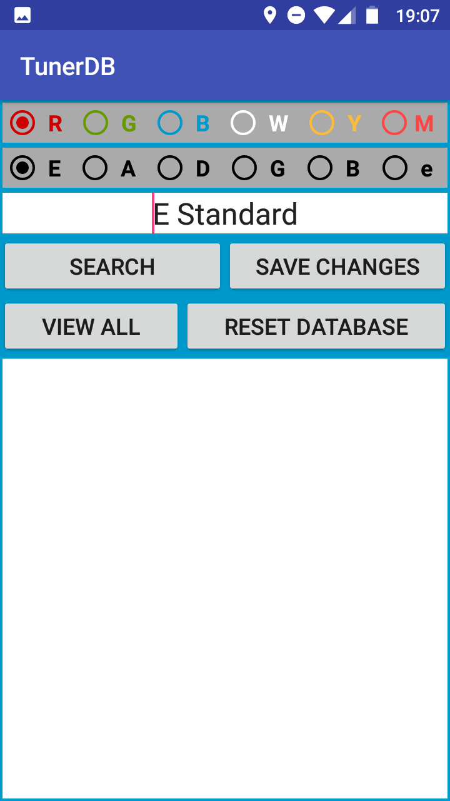
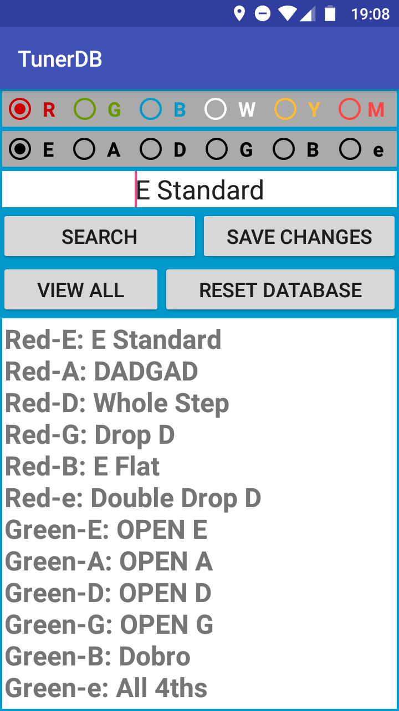
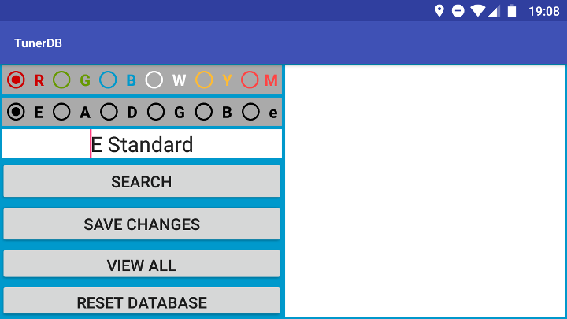
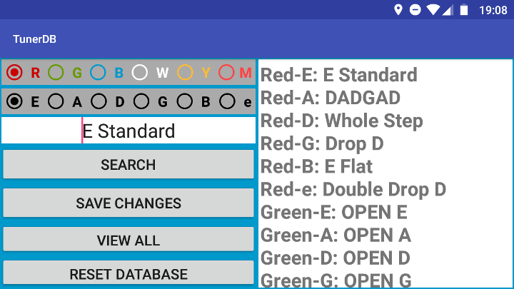

# TunerDB  
### TunerDB is an Android App to keep a list of the tuning presets of a Gibson G-Force or Tronical Automatic Tuning System.  
#### This is an inofficial app and in no way associated with Gibson, Tronical or their Trademarks.  

## Get the App
### Manual Installation without an App Store  
#### Just download [this file](release/app-release.apk) and install it manualy to your device.  
### App Stores 

## Screenshots
|||  
|------------------------------------|------------------------------------|
||| 